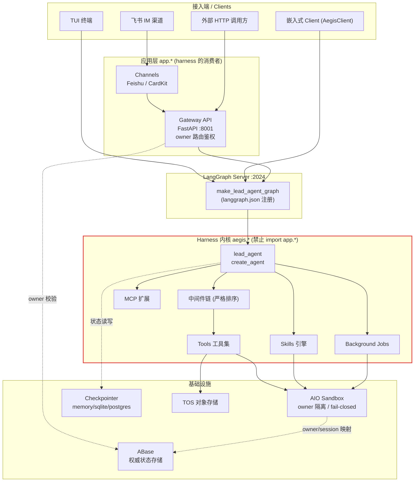
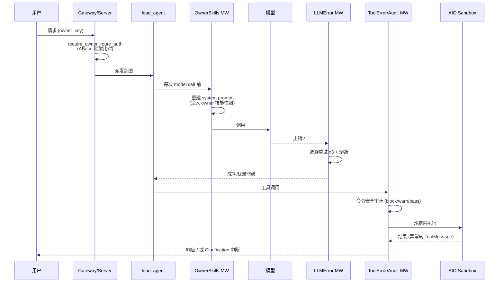
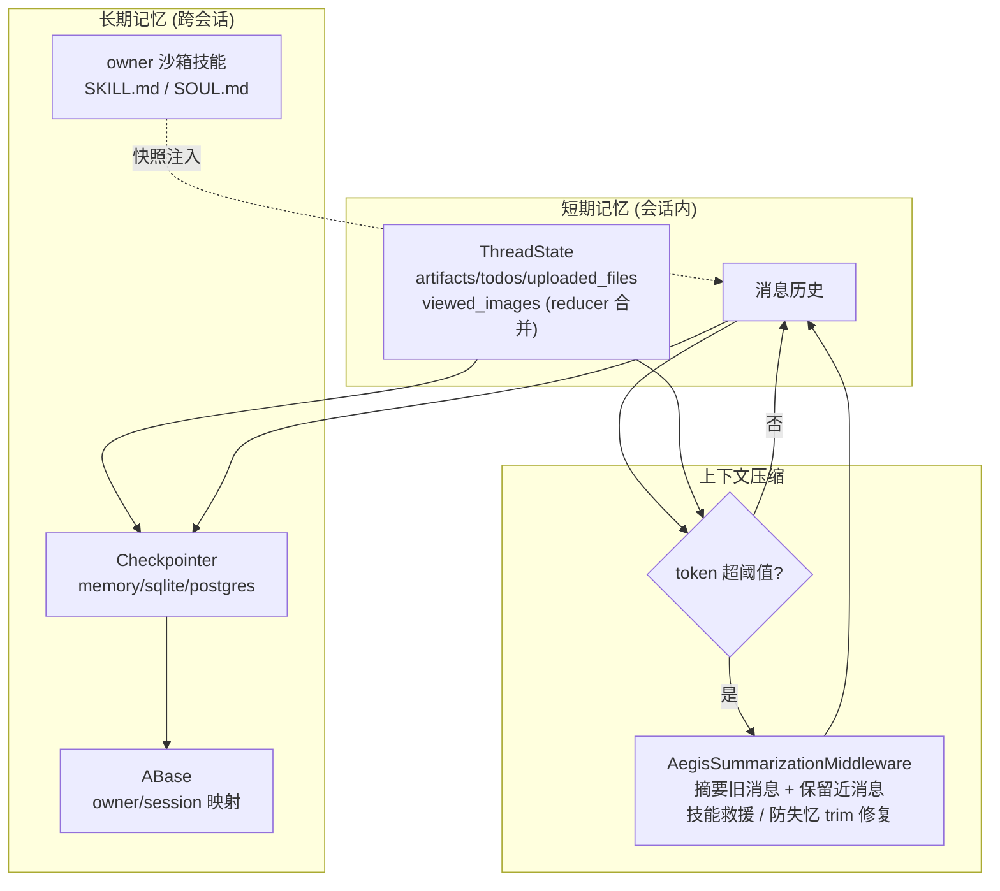
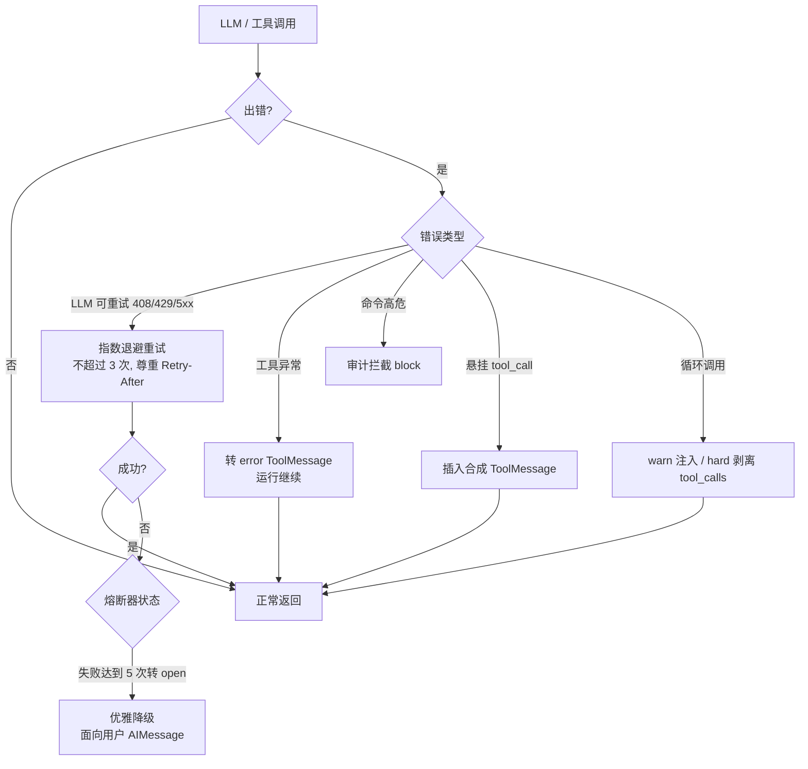

# Aegis(tob_audit_agent)项目详解与架构文档

> 分析对象:`tob_audit_agent-master`(内部代号 **Aegis**,版本 `1.2.4`)
> 一个基于 **LangGraph** 构建的企业级(ToB)后端型智能审核 / 通用 Super Agent 系统。
> 本文基于对项目源码(harness 内核、中间件、工具、技能、网关、渠道、MCP、沙箱)的通读整理,涵盖功能、技术栈与整体架构图。

---

## 目录

1. [项目概述](#1-项目概述)
2. [核心功能](#2-核心功能)
3. [技术栈](#3-技术栈)
4. [代码结构](#4-代码结构)
5. [三大运行入口](#5-三大运行入口)
6. [Agent 内核与中间件链](#6-agent-内核与中间件链)
7. [工具调用体系](#7-工具调用体系)
8. [Skills 技能系统](#8-skills-技能系统)
9. [记忆与状态持久化](#9-记忆与状态持久化)
10. [沙箱系统(AIO Sandbox)](#10-沙箱系统aio-sandbox)
11. [健壮性与容错](#11-健壮性与容错)
12. [用户管理与鉴权](#12-用户管理与鉴权)
13. [后台任务、MCP 与渠道](#13-后台任务mcp-与渠道)
14. [整体架构图](#14-整体架构图)
15. [总结](#15-总结)

---

## 1. 项目概述

Aegis 是一个**后端型(backend-only)AI Super Agent 系统**。它以 LangGraph 为执行引擎,
围绕「一套 Agent 内核(harness),多个接入入口」的思想构建,具备以下核心特征:

- **按 owner 隔离的沙箱执行**:所有具副作用的操作都在租户隔离的 AIO Sandbox 中运行,fail-closed(无宿主机回退)。
- **检查点式状态持久化**:通过 Checkpointer 保存完整会话状态,实现跨轮次记忆。
- **可扩展的工具 / 技能 / MCP 集成**:内置工具 + 可自演进的技能体系 + 标准 MCP 协议扩展。
- **多入口统一内核**:LangGraph Server、Gateway API、TUI、飞书(Feishu)IM 渠道共用同一套 harness。

项目最核心的架构约束是 **导入防火墙(Import Firewall)**:harness 内核代码(`aegis.*`)
**绝不允许** 导入应用层(`app.*`),由 CI 测试 `test_harness_boundary.py` 强制校验,
保证内核可独立复用、依赖方向单一。

---

## 2. 核心功能

| 功能域 | 说明 |
|---|---|
| **对话式 Agent** | 基于 LangGraph `create_agent`,支持多轮对话、工具调用、思考(thinking)模式、计划(plan)模式。 |
| **沙箱代码执行** | 在 owner 隔离沙箱中执行 bash、文件读写、代码运行等,具命令安全审计。 |
| **技能(Skills)系统** | 双层技能体系(公共 + 用户自定义),支持技能发现、启用、演进与安全扫描。 |
| **文件与产物管理** | 上传文件(`/mnt/uploads`)、产物输出(`$HOME/.aegis/outputs`)、TOS 对象存储、图片查看。 |
| **后台任务** | 长耗时技能可通过 Background Jobs 子系统异步运行,不阻塞 Agent 主循环。 |
| **人机协同** | `ask_clarification` 中断式澄清机制,向用户结构化提问后再续跑。 |
| **上下文压缩** | 超 token 阈值时自动摘要旧消息,并有「技能救援」防止刚加载的技能被冲掉。 |
| **失败重试与熔断** | LLM 调用指数退避重试 + 熔断器 + 优雅降级。 |
| **多渠道接入** | 飞书 IM 渠道(流式、CardKit 卡片渲染、文件收发、反馈 footer)。 |
| **MCP 扩展** | 支持 stdio / SSE / HTTP 三种 transport 的 MCP server 接入,含 OAuth。 |
| **可观测性** | 流事件(如 `llm_retry`)+ JSON 审计日志 + LangSmith tracing。 |

---

## 3. 技术栈

| 层次 | 选型 |
|---|---|
| Agent 框架 | **LangGraph + LangChain**(`create_agent`、`AgentMiddleware`、`AgentState`、`Checkpointer`、`Command`) |
| 语言 / 运行时 | Python 3.12+ |
| 包管理 | **uv**(workspace 模式,harness 作为子包) |
| API 网关 | **FastAPI + uvicorn**(端口 8001) |
| Agent Server | **LangGraph Server**(端口 2024) |
| 终端交互 | **Textual** TUI |
| IM 渠道 | 飞书 `lark-oapi`(CardKit 卡片) |
| 模型 | 火山引擎方舟 `volcengine-python-sdk[ark]`(豆包 Doubao)、字节 `bytedance-bytedai` |
| 沙箱 | **AIO Sandbox**(`agent-sandbox`,owner 隔离、fail-closed) |
| 共享状态存储 | **ABase**(`bytedabase`,owner/session 映射的权威源) |
| 对象存储 | **TOS**(`bytedtos` / `tosutil`) |
| 文档处理 | `pymupdf`(PDF)、`openpyxl`(Excel) |
| 代码规范 | **ruff**(lint + format,line length 240) |
| 测试 | pytest + pytest-asyncio |
| Tracing | LangSmith(可选) |

---

## 4. 代码结构

```
aegis/ (tob_audit_agent-master)
├── config.yaml                  # 主配置(models/tools/sandbox/jobs/skills/channels...)
├── extensions_config.json       # MCP servers + skills 启用状态
├── VERSION                      # 语义化版本(MAJOR.MINOR.PATCH),提交前必升
├── AGENTS.md                    # 面向 AI/开发者的架构与硬规则说明
├── backend/                     # 后端主工作区
│   ├── langgraph.json           # LangGraph server 配置(注册 make_lead_agent_graph)
│   ├── packages/harness/aegis/  # 【harness 内核包】import 前缀:aegis.*
│   │   ├── agents/              # Agent 系统:lead_agent、middlewares、thread_state、factory
│   │   ├── sandbox/             # 沙箱执行:AIO provider、tools、middleware、session 协调
│   │   ├── tools/               # 工具集:tools.py + builtins/(present_file/clarification/jobs/...)
│   │   ├── skills/              # 技能引擎:manager/loader/parser/security_scanner/owner_store
│   │   ├── mcp/                 # MCP 客户端:client/cache/oauth/tools
│   │   ├── models/              # 模型工厂:factory + doubao_provider
│   │   ├── jobs/                # 后台任务:manager/supervisor/aio_watcher/store
│   │   ├── runtime/             # 运行时:runs/store/stream_bridge/serialization
│   │   ├── storage/            # ABase 存储封装
│   │   ├── config/             # 各类配置模型(app/model/sandbox/jobs/skills/...)
│   │   ├── reflection/         # 反射解析(resolvers)
│   │   ├── tui/                # 终端交互界面(Textual)
│   │   └── client.py           # 嵌入式 Python 客户端 AegisClient
│   ├── app/                    # 【应用层】import 前缀:app.*(harness 的消费者)
│   │   ├── gateway/            # FastAPI Gateway:app.py + routers/ + security.py
│   │   └── channels/           # IM 渠道集成:feishu/(卡片/流式/文件收发)
│   ├── scripts/                # 运维脚本(如僵尸会话清理)
│   └── tests/                  # 测试套件(含 test_harness_boundary.py)
├── docs/                       # 详细文档(backend/skills/plan/architecture)
└── skills/public/             # 内置公共技能(pe-toolkit / precision-recall-report / bytedcli 等)
```

---

## 5. 三大运行入口

Aegis 采用「一套 harness,多入口消费」的后端架构,共有三个运行面(Runtime Surfaces):

1. **LangGraph Server(端口 2024)**:Agent 运行时与工作流执行核心。`langgraph.json`
   注册异步入口 `make_lead_agent_graph(config)`,负责本地 JWT bootstrap + 图构建。
2. **Gateway API(FastAPI,端口 8001)**:对外 REST 接口,覆盖 models、MCP、skills、
   artifacts、uploads、threads、jobs;含 owner 路由鉴权;健康检查 `GET /health`。
3. **TUI(终端)**:基于 Textual 的交互界面,便于本地开发调试。

此外还提供 **嵌入式客户端 `AegisClient`**(`client.py`),可在进程内直接调用 Aegis 能力(无 HTTP 服务),返回类型与 Gateway API schema 对齐。

---

## 6. Agent 内核与中间件链

### 6.1 Lead Agent

- 入口 `agents/lead_agent/agent.py` 的异步 `make_lead_agent_graph(config)`:把本地 JWT
  bootstrap + 图构建卸载到 worker 线程;同步 `make_lead_agent(config)` 只消费预加载的
  auth 状态,不阻塞。
- 模型经 `create_chat_model()` 构建,工具经 `get_available_tools()` 获取,系统 prompt 经
  `apply_prompt_template()` 注入。
- 运行时配置通过 `config.configurable` 传入:`thinking_enabled`、`model_name`、`is_plan_mode`。

### 6.2 中间件链(严格排序)

健壮性通过一条**严格排序的中间件链**集中实现。`factory.py` 的 `_assemble_from_features`
固定顺序如下(源码注释即为权威顺序):

```
0-2  Sandbox 基础设施(ThreadData / Uploads / Sandbox)
3    DanglingToolCall     悬挂 tool_call 修补(always)
4    Guardrail            护栏(guardrail feature)
5    ToolErrorHandling    工具异常兜底(always)
6    Summarization        上下文压缩(summarization feature)
7    Todo                 任务规划(plan_mode)
8    Title                会话标题(auto_title feature)
9    ViewImage            视觉(vision feature)
10   LoopDetection        循环检测(always)
11   Clarification        澄清(必须最后 / always last)
```

除固定链外,还有 `OwnerSkillsMiddleware`(model call 前重建 system prompt)、
`LLMErrorHandlingMiddleware`(重试 / 熔断)、`SandboxAuditMiddleware`(命令审计)、
`OwnerActivityMiddleware`、`TokenUsageMiddleware`、`ToolProgressMiddleware` 等协同工作。
`_insert_extra` 支持 @Next / @Prev 锚定插入,并做冲突 / 环检测。

---

## 7. 工具调用体系

### 7.1 工具注册与筛选

核心入口 `tools/tools.py` 的 `get_available_tools(groups, include_mcp, model_name)`,
组合三类工具:

- **内置工具(builtins)**:
  - `present_files` — 仅暴露 `$HOME/.aegis/outputs`,并强制飞书出站限制(文件 ≤ 30MB、图片 ≤ 10MB)。
  - `ask_clarification` — 被 ClarificationMiddleware 拦截(中断式澄清)。
  - `view_image` — 读取沙箱图片字节(PNG/JPEG/WebP ≤ 10MiB),仅视觉模型启用。
  - `tos_storage` — 唯一的 TOS 入口(直接沙箱 `tosutil` 被拦截)。
  - `setup_agent` — 引导式创建自定义 Agent。
  - `upgrade_public_skills` — 刷新公共技能到 owner 沙箱。
  - `run_background` / `check_job` / `list_jobs` / `cancel_job` — 仅当 `jobs.enabled` 时注册。
- **config 定义的工具**:经 `resolve_variable()` 解析。
- **MCP 工具**:从启用的 MCP server 加载。

工具按 tool name 去重,并按 **group** 分组,可按 Agent 配置裁剪暴露面。

### 7.2 工具执行的中间件包裹

工具调用不是裸执行,而是被中间件层层包裹:

- **ToolErrorHandlingMiddleware**:把工具异常转成 error `ToolMessage`,使运行不中断;检测被截断 / 半 JSON 参数并给中文提示;保留 `GraphBubbleUp` 控制流异常。
- **SandboxAuditMiddleware**:对 bash 命令做三级安全分级(block / warn / pass)。
- **DanglingToolCallMiddleware**:修补「有 tool_call 但缺 ToolMessage」的悬挂调用。

---

## 8. Skills 技能系统

### 8.1 双层技能体系

| 类型 | 存储位置 | 说明 |
|---|---|---|
| **Public Skills** | 宿主 `skills/public` | 全局共享、经审校 |
| **Custom Skills** | owner 沙箱 `$HOME/.aegis/skills/custom` | 用户私有、可自演进 |

每个 Skill 是一个目录 + `SKILL.md`,采用 **YAML frontmatter** 声明元数据
(`name`、`description`、`license`、`long_running`、`protected_cli` 等)。

内置公共技能包括:`pe-toolkit`(PE 生命周期 CLI:evaluate/optimize/auto/report,long_running)、
`precision-recall-report`(HTML 报告生成器,可选 TOS 上传)、`bytedcli`(字节内部 CLI 工具集)、
`rcflow`(RCFlow 工作流 CLI)。

### 8.2 技能管理与安全

- `manager.py`:命名校验(hyphen-case)、防路径穿越(白名单子目录 `references/templates/scripts/assets`)、原子写、`HISTORY.jsonl` 变更历史、frontmatter 校验。
- `security_scanner.py`:`scan_skill_content` 用 **LLM(moderation_model)** 把技能内容分类为
  allow / warn / block,重点识别 **prompt injection、提权、数据外泄**;扫描不可用则 **fail-closed 到 block**。

### 8.3 技能注入与 Prompt 优先

- `OwnerSkillsMiddleware` 在**每次 model call 前**从持久化快照重建 system prompt,注入 owner 技能;
  首次冷创建的 `provider.acquire()` 也发生在此(把沙箱唤醒 banner 传到渠道)。
- system prompt 确立 **skill-first** 工作流:优先复用已有技能;启用技能有缓存 + 后台刷新机制。

---

## 9. 记忆与状态持久化

Aegis 的记忆由 **检查点持久化 + 上下文压缩 + 结构化状态字段** 三部分组成。

### 9.1 检查点(Checkpointer)

`checkpointer/provider.py` 支持三种后端:

| 后端 | 实现 | 特性 |
|---|---|---|
| memory | `InMemorySaver` | 进程内、不持久 |
| sqlite | `SqliteSaver` | 本地文件持久化 |
| postgres | `PostgresSaver` | 生产级持久化 |

Checkpointer 保存完整 `ThreadState`,实现「跨轮次会话记忆」。

### 9.2 上下文压缩(AegisSummarizationMiddleware)

继承 `SummarizationMiddleware`,是记忆系统的精华:

- **超阈值触发**:token 超限时把旧消息摘要化(`RemoveMessage` + 摘要 + 保留近消息)。
- **技能救援(skill rescue)**:抢救最近加载的技能内容,避免刚读入的技能被摘要冲掉。
- **防失忆修复**:重写 trim 逻辑,规避「system prompt 运行时注入导致切片为空→整段历史被丢弃」的 bug。

### 9.3 结构化状态(ThreadState)

`ThreadState(AgentState)` 用 `Annotated + reducer` 管理可合并字段:`sandbox`、`thread_data`、
`title`、`artifacts`(merge_artifacts 去重)、`todos`、`uploaded_files`、`viewed_images`(merge_viewed_images)。

### 9.4 权威持久层

owner / session 映射的权威存储在 **ABase**;技能、SOUL.md 等落在 owner 沙箱,构成跨会话长期记忆。

---

## 10. 沙箱系统(AIO Sandbox)

活跃 provider 为 `aegis.sandbox.aiosandbox.provider:AioSandboxProvider`,owner 感知、
**永不回退宿主 / 本地执行**(fail-closed)。

**Agent 可见路径**:

- `$HOME/.aegis/workspace` — 工作目录
- `/mnt/uploads/<thread_id>/<transfer_id>/...` — 上传文件
- `$HOME/.aegis/outputs` — 可呈现的产物文件
- `/mnt/state` — 状态存储
- `$HOME/.aegis/skills` — 公共 / 自定义技能运行时副本

**核心规则**:`acquire()` 必须携带 `SandboxAcquireContext`(不支持裸 `thread_id`);
Gateway 与 LangGraph 进程必须共享 ABase 的 owner/session 映射;`/mnt` 隔离在 acquire 时
用挂载元数据或 `/mnt/.aegis-owner-key` 标记验证,不匹配即硬失败。

**生命周期**:默认 6h TTL、2h 续租、3h 空闲回收;空闲会话**暂停并可恢复**而非死亡;
容量上界 `max_owner_sessions`(默认 50)。`session_coordinator.py` 负责所有权 / 状态协调。

---

## 11. 健壮性与容错

### 11.1 循环检测(loop_detection)

两层防护:完全相同调用检测(顺序无关 md5 hash)+ 同类工具高频检测;阈值 warn=5 / hard=8 / window=40;
告警以 **HumanMessage** 注入(规避 Anthropic error),硬停时剥离 tool_calls。

### 11.2 悬挂调用修补(dangling_tool_call)

修补「AIMessage 有 tool_calls 但缺对应 ToolMessage」(常由中断产生),插入合成 error ToolMessage。

### 11.3 命令安全审计(sandbox_audit)

对 bash 做三级分类:

- **高危拦截(block)**:递归强删根目录、磁盘写入 / 格式化、管道到 shell 执行、命令替换、
  编解码后执行、覆盖系统二进制、预加载注入、反向 shell、fork 炸弹、protected CLI(如 `tosutil`)等。
- **中危告警(warn)**:开放全权限 `chmod`、`pip install`、`sudo`。
- 引号感知的复合命令拆分、`/mnt` 写保护、输入净化、JSON 审计日志。

### 11.4 失败重试 + 熔断(llm_error_handling)

- **重试**:指数退避,`retry_max_attempts=3`,base 1000ms / cap 8000ms;尊重 `Retry-After`;
  可重试码 `{408,409,425,429,500,502,503,504}`;发射 `llm_retry` 流事件。
- **熔断器**:`failure_threshold=5`、`recovery_timeout=60s`;三态 closed / open / half_open。
- **优雅降级**:重试 / 熔断耗尽后返回面向用户的 AIMessage 兜底,不硬崩。

---

## 12. 用户管理与鉴权

- **Owner 隔离鉴权**(`gateway/security.py`):`require_internal_auth` 用 `hmac.compare_digest`
  校验 Bearer token;`require_owner_route_auth` 校验 `owner_key`(64-hex)并与 **ABase 中的
  thread-owner 映射** 比对,返回 401/403/404;owner 路由必须绑定 `AioSandboxProvider`。
- **用户信息索引**(`user_info_store.py`):`users.json` 是**运营用途辅助索引**(以邮箱前缀为 key,
  非权威、fail-open、文件权限 0600、隐私字段最小化);权威身份下沉到 ABase。
- **本地直启鉴权**:本地启动会 bootstrap 一个 CSPRNG 共享密钥(`~/.aegis/local-auth`,0700/0600),
  使 LangGraph / Gateway 进程收敛;外部 env 值优先且不轮换。

---

## 13. 后台任务、MCP 与渠道

### 13.1 后台任务(jobs)

`JobManager` 编排 create/get/list/cancel/reap。AIO 任务在 owner 沙箱内经
`bash.exec(async_mode=True)` 运行,detached `aio_watcher` 轮询状态 / 日志,完成时 POST Gateway
internal-notify webhook;宿主 / 本地任务用 detached `supervisor`。重启时 AIO→unknown、host→failed。
system prompt 明确「后台任务不轮询」规则。

### 13.2 MCP 扩展(mcp)

`MultiServerMCPClient` 支持 **stdio / SSE / HTTP** 三种 transport,含 env、headers、OAuth
(`oauth.py`);懒加载 + 基于 mtime 的缓存失效;从 `extensions_config.json` 读取启用的 MCP server,
单个 server 配置失败不影响其它(容错加载)。

### 13.3 IM 渠道(Feishu)

`app/channels/feishu/` 通过 LangGraph SDK HTTP 客户端桥接飞书:

- **单用户单线程**:所有消息折叠到一个 `(channel, chat_id, user_id)` 线程。
- **运行卡片(running-card)**:初始状态由 owner-scoped AIO session 绑定分类(无会话→创建 banner、
  PAUSED→恢复 banner、ACTIVE→立即处理)。
- **入站媒体**:视频作为 `media` 资源处理,保留 `resource_type="media"`。
- **群 @所有人**(`@_all` / `@所有人`)被忽略,不触发 Agent。
- **文件大小护栏**:入站受 `transfer.upload_memory_limit_bytes`(100MB)约束;出站受飞书限制(文件 30MB、图片 10MB)。
- **反馈 footer**:最终 Answer 卡片带反馈按钮,仅原始请求者可点击。

---

## 14. 整体架构图

### 14.1 整体分层架构



> 红框标注的 **Harness 内核** 受「导入防火墙」保护:`aegis.*` 绝不允许 import `app.*`,由 CI `test_harness_boundary.py` 强制。

### 14.2 中间件链执行顺序

```mermaid
flowchart LR
    In["用户输入"] --> S0["0-2 Sandbox 基础设施"]
    S0 --> D["3 DanglingToolCall<br/>悬挂调用修补"]
    D --> G["4 Guardrail 护栏"]
    G --> TE["5 ToolErrorHandling<br/>工具异常兜底"]
    TE --> SUM["6 Summarization<br/>上下文压缩"]
    SUM --> TD["7 Todo"]
    TD --> TI["8 Title"]
    TI --> VI["9 ViewImage"]
    VI --> LD["10 LoopDetection<br/>循环检测"]
    LD --> CL["11 Clarification<br/>(必须最后)"]
    CL --> Model["LLM 调用<br/>(含重试/熔断)"]
    Model --> Out["响应 / 工具调用"]
```



### 14.3 单轮请求处理时序



### 14.4 记忆系统数据流



### 14.5 容错与健壮性决策流



---

## 15. 总结

Aegis(tob_audit_agent)是一个工程化程度很高的企业级后端 Agent 系统,其设计亮点在于:

1. **架构边界清晰**:Import Firewall + CI 强校验,harness 内核与应用层彻底解耦,内核可独立复用。
2. **健壮性工程化**:严格排序的中间件链,循环检测、悬挂调用修补、工具 / LLM 异常兜底、命令审计各司其职。
3. **记忆系统深思熟虑**:摘要中间件针对「system prompt 运行时注入」特性重写 trim 逻辑,规避失忆 bug,并有技能救援。
4. **安全优先(fail-closed)**:沙箱无宿主回退、技能扫描不可用即 block、命令高危拦截、owner 鉴权,处处体现审核类产品的安全底线。
5. **多入口统一内核**:LangGraph Server / Gateway / TUI / Feishu 共用一套 harness。
6. **完整的容错三段式**:重试 + 熔断 + 优雅降级。

**可改进方向**:引入显式多 Agent 编排(初审→复审→仲裁流水线)、增加显式 reflection/self-critique 环节、
构建结构化「审核知识库 / 判例记忆」、补充审核准确率与一致性的离线评测闭环。

---

*本文档基于对 `tob_audit_agent-master`(Aegis v1.2.4)源码的系统性通读整理而成,涵盖 harness 内核、中间件、工具、技能、网关、渠道、MCP 与沙箱等维度。*
