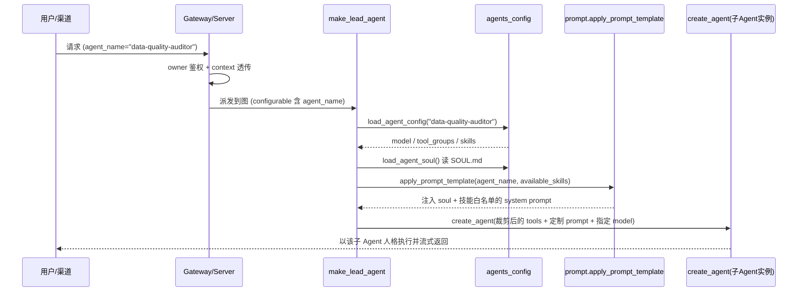

# 子智能体(Sub-Agent)设计、应用与实现详解

> 分析对象:`tob_audit_agent-master`(内部代号 **Aegis**,版本 `1.2.4`)
> 一个基于 **LangGraph** 构建的企业级(ToB)后端型智能审核 / 通用 Super Agent 系统。
> 本文聚焦「子智能体」这一概念,从**设计思想 → 落地实现 → 项目内应用举例**三个层次,结合源码逐一拆解。

---

## 目录

1. [什么是「子智能体」——本项目的定义](#1-什么是子智能体本项目的定义)
2. [设计动机与整体思路](#2-设计动机与整体思路)
3. [两条实现路线的全景](#3-两条实现路线的全景)
4. [路线一:配置驱动的自定义子 Agent(SOUL.md 机制)](#4-路线一配置驱动的自定义子-agentsoulmd-机制)
5. [路线二:运行期子 Agent 派生(task_tool / subagent 预留)](#5-路线二运行期子-agent-派生task_tool--subagent-预留)
6. [子智能体的生命周期(完整时序)](#6-子智能体的生命周期完整时序)
7. [关键源码走读](#7-关键源码走读)
8. [在 Aegis 审核场景中的应用举例](#8-在-aegis-审核场景中的应用举例)
9. [子智能体 vs 技能 vs 中间件——边界厘清](#9-子智能体-vs-技能-vs-中间件边界厘清)
10. [设计评价、约束与演进方向](#10-设计评价约束与演进方向)
11. [总结](#11-总结)

---

## 1. 什么是「子智能体」——本项目的定义

在 Aegis 中,**「子智能体(Sub-Agent)」不是一个独立进程或独立服务**,而是指:

> 在**同一套 harness 内核(`aegis.*`)之上**,通过**不同的人格(SOUL.md)、工具集(tool_groups)、技能白名单(skills)与模型(model)** 实例化出来的、面向特定职责的 Agent 实例。

架构文档对此有一句纲领性的表述:

> Aegis 以 **单主 Agent(lead_agent)+ 自定义子 Agent** 的方式组织。
> ——`ARCHITECTURE_ANALYSIS.md` 第 4 章

也就是说,Aegis 采用的是 **"一个内核、多重人格" 的编排范式**:所有 Agent(无论主还是子)都由同一个工厂 `make_lead_agent` / `create_aegis_agent` 造出,差异**完全由配置(`config.yaml` + `SOUL.md`)决定**,而非由不同的代码分支决定。这是理解本项目子智能体设计的第一把钥匙。

---

## 2. 设计动机与整体思路

企业审核(audit)场景天然是**多职责、多领域**的:合规审阅、数据质量校验、异常分析、PE 标注、精确率/召回率报告……如果把所有职责的 prompt、工具、规则都塞进一个巨型 Agent,会带来:

- **上下文污染**:无关领域的指令互相干扰,降低单任务准确率;
- **工具爆炸**:一次性把几十个工具暴露给 LLM,增加误调用率(项目注释里专门提到 issue #1803 的「工具名歧义」问题);
- **难以治理**:无法按职责裁剪权限。

Aegis 的解法是**「配置驱动的 Agent 编排」**:

| 维度 | 手段 | 源码位置 |
|---|---|---|
| 人格 / 职责 | `SOUL.md` 注入 system prompt | `agents_config.py:load_agent_soul` |
| 工具权限 | `tool_groups` 白名单裁剪 | `agents_config.py:AgentConfig.tool_groups` |
| 技能可见性 | `skills` 白名单(None=全部 / []=禁用 / [...]=指定) | `agents_config.py:AgentConfig.skills` |
| 模型 | 每个 Agent 可指定独立 `model` | `agents_config.py:AgentConfig.model` |

核心思想一句话:**用配置的组合爆炸,替代代码的分支爆炸。**

---

## 3. 两条实现路线的全景

项目里的「子智能体」实际由**两条并行的路线**共同支撑,一条已完整落地,一条为运行期派生预留:

```
                        ┌─────────────────────────────────────────┐
                        │  统一内核 harness (aegis.*)               │
                        │  create_aegis_agent / make_lead_agent     │
                        └───────────────┬───────────────────────────┘
                                        │
              ┌─────────────────────────┴──────────────────────────┐
              │                                                     │
   路线一(已落地)                                     路线二(预留/半落地)
   配置驱动的自定义子 Agent                              运行期子 Agent 派生
   ─────────────────────                              ─────────────────────
   • SOUL.md + config.yaml                            • subagent_enabled 开关
   • setup_agent 工具引导创建                           • max_concurrent_subagents
   • agents CRUD API 管理                              • factory 注释预留 task_tool
   • agent_name 路由到不同实例                           • context 透传到 configurable
```

> 说明:路线二的**配置通道已完整打通**(开关能从渠道层一路透传到图执行),但**运行期真正"派生一个子 Agent 去执行子任务"的 `task_tool` 尚未在本仓库内实现**——工厂文件的 docstring 明确标注这是 "Phase 2 目标"。下文会精确区分"已实现"与"预留"。

---

## 4. 路线一:配置驱动的自定义子 Agent(SOUL.md 机制)

这是**当前真正投入使用**的子智能体机制,由四个部件组成。

### 4.1 数据模型:`AgentConfig`

`backend/packages/harness/aegis/config/agents_config.py`:

```python
class AgentConfig(BaseModel):
    name: str
    description: str = ""
    model: str | None = None
    tool_groups: list[str] | None = None
    # skills:
    #   None  → 加载全部启用技能(默认)
    #   []    → 禁用所有技能
    #   [...] → 仅加载指定技能
    skills: list[str] | None = None
```

一个子 Agent = 一份 `AgentConfig` + 一份 `SOUL.md`,物理上落在 owner 沙箱的 `agents/<name>/` 目录下(`config.yaml` + `SOUL.md`)。`agent_name` 受正则 `^[A-Za-z0-9-]+$` 约束(`validate_agent_name`),因为它会被拼进文件系统路径,必须防注入。

### 4.2 人格注入:`SOUL.md`

`load_agent_soul()` 读取子 Agent 目录下的 `SOUL.md`,内容被包裹进 `<soul>...</soul>` 标签,拼接进 lead agent 的 system prompt:

```python
def get_agent_soul(agent_name: str | None) -> str:
    soul = load_agent_soul(agent_name)
    if soul:
        return f"<soul>\n{soul}\n</soul>\n"
    return ""
```

在 `SYSTEM_PROMPT_TEMPLATE` 里,`{soul}` 紧跟 `<role>` 之后注入——**这就是"换人格"的物理动作**:同一套内核,喂不同的 SOUL,就得到不同职责的子 Agent。

### 4.3 引导创建:`setup_agent` 工具

`tools/builtins/setup_agent_tool.py` 提供了一个特殊的内置工具,让主 Agent 能在对话中**"孵化"出一个新的子 Agent**:

```python
@tool
def setup_agent(soul: str, description: str, runtime: ToolRuntime,
                skills: list[str] | None = None) -> Command:
    """Setup the custom Aegis agent."""
    agent_name = runtime.context.get("agent_name")
    ...
    # 写入 config.yaml
    config_data = {"name": agent_name, "description": description, "skills": skills}
    yaml.dump(config_data, config_file)
    # 写入 SOUL.md
    soul_file.write_text(soul)
    return Command(update={"created_agent_name": agent_name, ...})
```

要点:

- 只有在 **bootstrap 模式**(`is_bootstrap=True`)下,lead agent 才会额外挂载 `setup_agent` 工具(见 `agent.py`),用于"创建子 Agent"这一引导流程;
- **失败自动清理**:若写入过程出错且目录是本次新建的,`shutil.rmtree` 回滚,保证不留半成品(事务性)。

### 4.4 路由与管理:`agent_name` + CRUD API

- **路由**:请求携带 `agent_name` → `make_lead_agent` 调 `load_agent_config(agent_name)` → 用该子 Agent 的 model / tool_groups / skills 组装图。`agent_name=None` 即默认主 Agent。
- **管理**:`app/gateway/routers/agents.py` 暴露完整 CRUD——`list_agents` / `get_agent` / `create_agent` / `update_agent` / `delete_agent` / `check_agent_name`,让子 Agent 可被外部系统增删改查。

### 4.5 组装入口:`make_lead_agent`

`agents/lead_agent/agent.py` 是所有 Agent(主 / 子)共同的组装点:

```python
agent_config = load_agent_config(agent_name) if not is_bootstrap else None
agent_model_name = agent_config.model if agent_config and agent_config.model else None
model_name = _resolve_model_name(requested_model_name or agent_model_name)  # 请求→子Agent配置→全局默认

available_skills = set(agent_config.skills) if agent_config and agent_config.skills is not None else None
return create_agent(
    model=create_chat_model(name=model_name, ...),
    tools=get_available_tools(model_name=model_name,
                              groups=agent_config.tool_groups if agent_config else None),  # 工具裁剪
    middleware=_build_middlewares(config, model_name, agent_name, available_skills),
    system_prompt=apply_prompt_template(agent_name=agent_name,
                                        available_skills=available_skills),  # 人格+技能注入
    state_schema=ThreadState,
)
```

**同一段代码,靠 `agent_name` 一个参数,产出千人千面的子 Agent。** 这就是路线一的全部精髓。

---

## 5. 路线二:运行期子 Agent 派生(task_tool / subagent 预留)

区别于路线一的"静态人格切换",路线二面向的是**运行期动态派生**:主 Agent 在执行大任务时,把一个可并行的子任务**委派给一个临时子 Agent** 去独立跑,再收回结果。这类似 Claude 的 `Task` 子代理。

### 5.1 已经打通的部分:配置透传链路

`subagent_enabled` 与 `max_concurrent_subagents` 两个开关**已经从最外层一路透传到图执行的 `configurable`**:

- **渠道层默认值**(`app/channels/manager.py`):
  ```python
  DEFAULT_RUN_CONTEXT = {
      "thinking_enabled": True,
      "is_plan_mode": False,
      "subagent_enabled": False,   # 默认关闭
  }
  ```
- **Gateway 白名单透传**(`app/gateway/services.py`):
  ```python
  _CONTEXT_CONFIGURABLE_KEYS = {
      "model_name", "mode", "thinking_enabled", "reasoning_effort",
      "is_plan_mode",
      "subagent_enabled", "max_concurrent_subagents",   # ← 子 Agent 开关
      "agent_name", "is_bootstrap",
  }
  ```
- **客户端 API 文档**(`client.py`):`stream()` 的 kwargs 明确列出 `subagent_enabled`、`recursion_limit`。

### 5.2 尚未落地的部分:`task_tool` 本体

工厂 `agents/factory.py` 的模块 docstring 与函数 docstring **两处**明确点名了它:

```python
"""
...some injected runtime components (e.g. ``task_tool`` for subagent) may
still read global config at invocation time.  Full config-free runtime is a
Phase 2 goal.
"""
```

但在本仓库范围内 `grep` 全量代码,**并没有找到 `task_tool` 的实际定义、也没有 `subagent_enabled` 的消费点**(除文档字符串与透传外)。结论:

> 路线二是一条**已铺好管道、但阀门后端(真正的 task_tool 派生器)尚未接入**的能力。配置协议、并发上限、递归上限(`recursion_limit: 1000` 见 `config.yaml`)均已就位,属于典型的"接口先行、实现待补"的 Phase 2 预留。

这一区分很重要:**评审 / 讲解时若声称 Aegis 已支持运行期子 Agent 并行派生,是不准确的;准确表述是"具备配置协议与扩展点,实体派生器待实现"。**

---

## 6. 子智能体的生命周期(完整时序)

以**路线一(自定义子 Agent)**为例,一次带 `agent_name` 的请求全生命周期:



而**创建**一个子 Agent 的生命周期(bootstrap 流程):用户 → lead agent(bootstrap 模式,挂载 `setup_agent`)→ LLM 生成 SOUL 内容 → 调 `setup_agent` 工具 → 写盘 `config.yaml` + `SOUL.md` → 返回 `created_agent_name`。此后该子 Agent 即可被 `agent_name` 路由命中。

---

## 7. 关键源码走读

| 关注点 | 文件 | 关键符号 |
|---|---|---|
| 子 Agent 数据模型 | `config/agents_config.py` | `AgentConfig` / `validate_agent_name` |
| 人格加载 | `config/agents_config.py` | `load_agent_soul` / `SOUL_FILENAME` |
| 子 Agent 枚举 | `config/agents_config.py` | `list_custom_agents` |
| 组装工厂(应用级) | `agents/lead_agent/agent.py` | `make_lead_agent` / `_build_middlewares` |
| 组装工厂(SDK 级) | `agents/factory.py` | `create_aegis_agent` / `_assemble_from_features` |
| 人格 + 技能注入 | `agents/lead_agent/prompt.py` | `apply_prompt_template` / `get_agent_soul` |
| 引导创建工具 | `tools/builtins/setup_agent_tool.py` | `setup_agent` |
| CRUD 管理 API | `app/gateway/routers/agents.py` | `create_agent_endpoint` 等 |
| 子 Agent 开关透传 | `app/gateway/services.py` | `_CONTEXT_CONFIGURABLE_KEYS` |
| 开关默认值 | `app/channels/manager.py` | `DEFAULT_RUN_CONTEXT` |
| task_tool 预留说明 | `agents/factory.py` | 模块/函数 docstring |

一个值得注意的工程细节:`create_aegis_agent`(SDK 级工厂)与 `make_lead_agent`(应用级工厂)**共用同一套中间件装配顺序**(0-2 沙箱 → 3 DanglingToolCall → … → 11 Clarification 必须最后)。这保证了无论主 Agent 还是任何子 Agent,行为护栏(工具错误兜底、循环检测、澄清中断)**完全一致**,不会因为换了人格就丢掉安全约束。

---

## 8. 在 Aegis 审核场景中的应用举例

结合审核(audit)业务与仓库内 `skills/public/` 已有的真实技能,给出四个典型子智能体的落地示例。

### 例 1:数据质量审核子 Agent(`data-quality-auditor`)

`agents/data-quality-auditor/config.yaml`:
```yaml
name: data-quality-auditor
description: 专注数据完整性/准确性/一致性/时效性四维校验的审核子 Agent
model: null                     # 用全局默认模型
tool_groups: [file:read, bash]  # 只读文件 + 执行校验脚本,禁写
skills: [precision-recall-report]  # 仅暴露"精确率召回率报告"技能
```

`agents/data-quality-auditor/SOUL.md`:
```markdown
你是资深数据质量审核员。任何批次数据到手,先按【完整性→准确性→一致性→时效性】
四维出具校验清单,再逐项给出证据与阈值判定。凡涉及删除/改写生产数据的动作,
必须先 ask_clarification 取得显式确认。所有结论必须可追溯到原始记录行号。
```

效果:当请求带 `agent_name=data-quality-auditor` 时,`make_lead_agent` 只加载 `file:read`+`bash` 工具组、只暴露 `precision-recall-report` 技能,并把上面这段 SOUL 注入 system prompt——一个"专才"子 Agent 就此诞生,而底层内核代码零改动。

### 例 2:PRD 合规审阅子 Agent(`compliance-reviewer`)

对应 system prompt 内建的 5 类澄清场景(`missing_info` / `ambiguous_requirement` / `approach_choice` / `risk_confirmation` / `suggestion`)。该子 Agent 的 SOUL 会强化"合规优先、先澄清后动手":遇到 PRD 缺少数据流向说明时,`ClarificationMiddleware` 拦截 `ask_clarification` 并通过 `Command(goto=END)` 中断,把结构化问题抛给用户——**这正是子 Agent 与用户的中断式通信通道**。工具组可裁剪为仅 `file:read`,杜绝其误触写操作。

### 例 3:PE 标注子 Agent(`pe-labeler`)

仓库内已有 `auto-pe-labeling`、`pe-toolkit` 两个 public 技能。可为标注职责建一个子 Agent,`skills: [auto-pe-labeling, pe-toolkit]`,`tool_groups: [file:read, file:write, bash]`。它与"数据质量审核子 Agent"的区别**仅在 SOUL + skills + tool_groups 三处配置**,却表现为两个专业度迥异的助手。

> 三例共同印证第 2 章的核心思想:**差异全在配置,内核完全复用。**

### 例 4(展望路线二):大批次审核的并行派生

设想一次"审核 10 万行交易数据"的任务。若 `subagent_enabled=True` 且 `task_tool` 落地,主 Agent 可将数据分片,`max_concurrent_subagents` 控制并发,派生多个临时子 Agent 并行校验各分片,最后汇总。当前该链路的**配置协议已就绪**(`services.py` 白名单 + `manager.py` 默认值 + `recursion_limit`),只待 Phase 2 补齐 `task_tool` 派生器即可启用。

---

## 9. 子智能体 vs 技能 vs 中间件——边界厘清

三者常被混淆,实则分工清晰:

| 概念 | 本质 | 粒度 | 是否改变"人格" | 典型载体 |
|---|---|---|---|---|
| **子智能体(Sub-Agent)** | 换人格/工具/技能的 Agent 实例 | Agent 级 | 是(SOUL.md) | `config.yaml` + `SOUL.md` |
| **技能(Skill)** | 可复用的任务工作流/最佳实践 | 任务级 | 否 | `skills/*/SKILL.md` |
| **中间件(Middleware)** | 横切的运行期护栏与增强 | 请求/调用级 | 否 | `middlewares/*.py` |

关系:**子智能体是"谁在做",技能是"怎么做一类任务",中间件是"做的过程中如何被约束/增强"。** 一个子 Agent 会**加载多个技能**、**串起一整条中间件链**,三者是包含而非并列关系。system prompt 里的 "Skill First" 工作流(先查技能再动手)对所有子 Agent 一视同仁。

---

## 10. 设计评价、约束与演进方向

**优点**
- **配置驱动、内核零改动**:新增职责=写一份 SOUL+config,极低的边际成本;
- **护栏一致性**:所有子 Agent 共享同一中间件链,安全约束不因人格切换而丢失;
- **权限最小化**:`tool_groups` / `skills` 白名单天然实现按职责裁剪,契合审核场景的合规诉求;
- **事务性创建**:`setup_agent` 失败自动 `rmtree` 回滚,不留脏目录。

**约束 / 注意点**
- **路线二尚未落地**:`task_tool` 仅有 docstring 预留,运行期并行派生**当前不可用**,不应对外宣称已支持;
- **名称即路径**:`agent_name` 会拼进文件系统路径,必须经 `validate_agent_name` 正则校验(已做),否则有路径穿越风险;
- **default 无 SOUL 时**:`get_agent_soul` 返回空串,子 Agent 退化为默认人格,需靠 config 的 tool_groups/skills 体现差异。

**演进方向**
1. 落地 `task_tool`,消费 `subagent_enabled` / `max_concurrent_subagents`,实现真正的运行期子 Agent 并行派生;
2. 将 factory docstring 所述 "config-free runtime"(Phase 2)完成,使子 Agent 派生不再依赖全局 config;
3. 子 Agent 间结果聚合与错误隔离策略(某分片子 Agent 失败不拖垮整体)。

---

## 11. 总结

Aegis 的「子智能体」是一套**"单内核、多人格"的配置驱动编排范式**:

- **已落地(路线一)**:通过 `AgentConfig` + `SOUL.md` + `setup_agent` 工具 + `agent_name` 路由 + CRUD API,实现了按职责实例化不同人格/工具/技能的自定义子 Agent,且所有子 Agent 共享同一条中间件护栏链;
- **已预留(路线二)**:`subagent_enabled`、`max_concurrent_subagents`、`recursion_limit` 的配置通道已从渠道层一路打通到图执行,`factory.py` 明确标注 `task_tool` 为 Phase 2 目标,运行期并行派生的实体实现待补。

一句话概括其设计哲学:**用配置的组合,替代代码的分支;用统一内核,承载千人千面。** 这正是它能在企业审核这一多职责、强合规场景下保持可扩展与可治理的根本原因。
