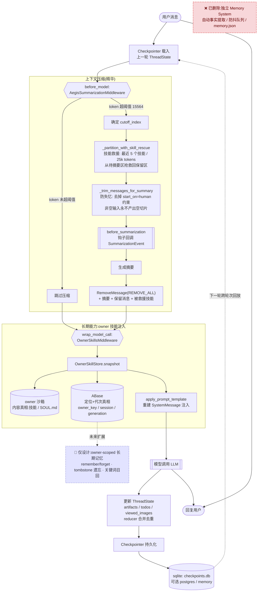

# 记忆系统设计详解 —— 以 Aegis(tob_audit_agent)项目为例

> 分析对象:`tob_audit_agent-master`(审计 Agent「Aegis」),后端基于 **LangGraph + LangChain**。
> 本文结合源码逐层拆解该项目的「记忆系统」现状,并区分「已实现」「已废弃」「仅设计」三种不同状态,避免被过时文档误导。

---

## 0. 一句话结论

**Aegis 目前没有传统意义上的「记忆数据库」。** 它的记忆能力由三层拼装而成:

1. **短期/会话记忆** —— LangGraph `Checkpointer` 保存整个 `ThreadState`,实现跨轮次记忆;
2. **上下文压缩(精华)** —— `AegisSummarizationMiddleware` 在 token 超限时智能摘要,并做「技能救援」与「防失忆修复」;
3. **跨会话长期能力** —— 通过 owner 沙箱里的技能快照 + `OwnerSkillsMiddleware` 在每次 model call 前重建 system prompt 注入。

此外还有两个需要特别澄清的历史包袱:一个**独立的「事实记忆」模块已被整体删除**;一份**owner-scoped 长期记忆的设计蓝图仍停留在评审草案阶段**。

---

## 0.1 记忆流转架构图

下图刻画了 Aegis 一次对话中记忆的**完整流转路径**:从用户消息进入,到 owner 技能注入、模型调用、超阈值时的摘要压缩(含技能救援 / 防失忆),再到检查点持久化与跨会话回放。



**读图要点**:

- **绿色主链**(用户 → 载入 → 压缩 → 注入 → LLM → 持久化 → 回放)是当前**已实现**的记忆闭环;两个中间件 `AegisSummarizationMiddleware`(before_model)与 `OwnerSkillsMiddleware`(wrap_model_call)是核心枢纽。
- **压缩子图**只在 token 超阈值时进入,其中「技能救援」和「防失忆」是 Aegis 相对 LangChain 基类的两处关键定制。
- **owner 子图**体现「内容真相在沙箱、定位真相在 ABase」的职责划分,每次 model call 都会重建 system prompt。
- **虚线红框**为已删除模块,**虚线紫框**为仅停留在设计草案的 owner 长期记忆,均不在当前运行链路中。

> 若渲染环境不支持 Mermaid,可参考下方等价的 ASCII 流程摘要:

```text
用户消息
  │
  ▼
[Checkpointer 载入上一轮 ThreadState]        ← sqlite checkpoints.db
  │
  ▼
before_model ─ AegisSummarizationMiddleware
  │   token 超阈值(15564)?
  │      ├─ 否 → 跳过
  │      └─ 是 → 技能救援(保留最近5技能/25k) → 防失忆裁剪 → before_summarization钩子
  │               → 生成摘要 → RemoveALL + 摘要 + 保留消息 + 被救援技能
  ▼
wrap_model_call ─ OwnerSkillsMiddleware
  │   OwnerSkillStore.snapshot
  │      ├─ owner 沙箱(内容真相:技能/SOUL.md)
  │      └─ ABase(定位+代次:owner_key/session/generation)
  │   → 重建 SystemMessage 注入
  ▼
[模型调用 LLM] → 更新 ThreadState(reducer 合并 artifacts/viewed_images)
  │
  ▼
[Checkpointer 持久化] → sqlite/postgres ──┐
  ▲                                        │
  └───────── 下一轮跨轮次回放 ◄────────────┘

(已删除)独立 Memory System:自动事实提取 / 防抖队列 / memory.json
(仅设计)owner-scoped 长期记忆:remember/forget · tombstone 遗忘 · 关键词召回
```

---

## 1. 三种状态的全景图

理解 Aegis 记忆系统的第一件事,是分清下面三类材料各自的真实状态。这一步至关重要,因为项目里同时存在「已实现的代码」「过时的文档」「未落地的设计」,混在一起会得出错误结论。

| 层面 | 状态 | 载体 / 证据 |
|---|---|---|
| 独立「事实记忆」模块(自动提取事实、防抖队列、`memory.json`) | **已删除** | 原 `agents/memory/` 目录 + `MemoryMiddleware`,见 `docs/plan/CLEANUP_PLAN.md` 第九阶段 |
| 短期/会话记忆 | **已实现** | `agents/checkpointer/provider.py` + `AegisSummarizationMiddleware` + `ThreadState` |
| 跨会话长期能力 | **部分实现**(技能/画像形态) | `OwnerSkillStore` + owner 沙箱 + `OwnerSkillsMiddleware` |
| owner-scoped 长期记忆(事实数据库形态) | **仅设计蓝图** | `docs/architecture/codex-long-term-memory-feasibility.md`(明确声明未实现) |

### 1.1 已删除的独立 Memory System

历史上 Aegis 实现过一个约 1700 行的独立 **Memory System**,用于存储用户上下文和对话事实。根据 `docs/plan/CLEANUP_PLAN.md` 第九阶段记录,因为「用户明确表示不需要 memory,Checkpoint 会保留」,它被**完整移除**:

- 删除 `backend/packages/harness/aegis/agents/memory/` 整个目录(`storage.py` 216 行、`queue.py` 266 行、`updater.py` 564 行、`prompt.py` 363 行、`message_processing.py`、`summarization_hook.py`、`__init__.py`,合计约 1700 行);
- 删除 `memory_middleware.py`、`config/memory_config.py`、`app/gateway/routers/memory.py`;
- 从 `RuntimeFeatures` 移除 `memory` 字段,从 `factory.py`、`lead_agent/agent.py`、`lead_agent/prompt.py` 移除所有挂载点与 `_get_memory_context()`;
- 删除全部 `test_memory_*.py` 测试(prompt injection / queue / router / storage / updater / upload_filtering)。

**验证**:在当前 `agents/middlewares/` 目录中已无任何 memory 相关文件,`grep` memory 中间件只剩非记忆用途的 `runtime/stream_bridge/memory.py`(那是 in-memory 事件流桥,与记忆无关)。

> ⚠️ **文档陷阱**:`docs/backend/MIDDLEWARES.md` 里仍描述了「MemoryMiddleware:防抖 30 秒、LLM 提取事实、原子写入 memory.json」,这是**过时残留文档**,与实际代码不符。以代码为准:这块「自动事实提取型长期记忆」现已不存在。

---

## 2. 短期/会话记忆:Checkpointer 检查点持久化

删除独立模块后,Aegis 的「跨轮次记住上文」完全依赖 LangGraph 原生的 Checkpointer 机制。

### 2.1 三种后端

源码 `backend/packages/harness/aegis/agents/checkpointer/provider.py` 通过一个上下文管理器工厂 `_sync_checkpointer_cm` 支持三种后端:

```python
# provider.py L56-92
if config.type == "memory":
    from langgraph.checkpoint.memory import InMemorySaver
    logger.info("Checkpointer: using InMemorySaver (in-process, not persistent)")
    yield InMemorySaver()
    return

if config.type == "sqlite":
    from langgraph.checkpoint.sqlite import SqliteSaver
    conn_str = resolve_sqlite_conn_str(config.connection_string or "store.db")
    ensure_sqlite_parent_dir(conn_str)          # 自动建父目录
    with SqliteSaver.from_conn_string(conn_str) as saver:
        saver.setup()                            # 自动建表
        yield saver
    return

if config.type == "postgres":
    from langgraph.checkpoint.postgres import PostgresSaver
    if not config.connection_string:
        raise ValueError(POSTGRES_CONN_REQUIRED)
    with PostgresSaver.from_conn_string(config.connection_string) as saver:
        saver.setup()
        yield saver
    return
```

| 后端 | 实现 | 特性 |
|---|---|---|
| `memory` | `InMemorySaver` | 进程内,重启即丢失(默认) |
| `sqlite` | `SqliteSaver` | 本地文件持久化,`ensure_sqlite_parent_dir` 自动建目录 + `setup()` 自动建表 |
| `postgres` | `PostgresSaver` | 生产级、多进程持久化 |

当前项目 `config.yaml` 实际启用的是 **sqlite**:

```yaml
# config.yaml L361-363
checkpointer:
  type: sqlite
  connection_string: checkpoints.db
```

### 2.2 单例 + 上下文管理器双入口

`provider.py` 同时提供两种获取方式,对应两类使用场景:

- **`get_checkpointer()`(单例)**:进程级缓存,首次调用创建后被 `_checkpointer` / `_checkpointer_ctx` 全局变量持有,供 LangGraph 图编译长期复用(L103-146)。
- **`checkpointer_context()`(一次性上下文)**:每个 `with` 块创建并销毁自己的连接,用于 CLI 脚本或测试中需要确定性清理的场景(L170-192)。

单例创建有一处**防御性懒加载逻辑**值得注意:当 `checkpointer_config` 为空且 `_app_config` 尚未初始化时,才去懒加载 `config.yaml`(L125-135)。这样做是为了「防止在 config.yaml 明明有 checkpointer 段、但尚未加载时错误地返回 InMemorySaver」,同时又让「显式设置了全局配置的测试」与磁盘上的 config.yaml 隔离。`reset_checkpointer()`(L149-162)负责关闭后端连接并清空缓存,用于配置变更或测试。

### 2.3 记住了什么:整个 ThreadState

Checkpointer 保存的是完整的 `ThreadState`,这是「同一会话跨轮次记忆」的核心载体。

---

## 3. 结构化状态:ThreadState 与可合并的记忆字段

源码 `agents/thread_state.py`。`ThreadState` 继承自 LangChain 的 `AgentState`,用 `Annotated + reducer` 管理可**增量合并**的记忆字段。

```python
# thread_state.py L54-61
class ThreadState(AgentState):
    sandbox: NotRequired[SandboxState | None]
    thread_data: NotRequired[ThreadDataState | None]
    title: NotRequired[str | None]
    artifacts: Annotated[list[str], merge_artifacts]                 # 带 reducer
    todos: NotRequired[list | None]
    uploaded_files: NotRequired[list[dict] | None]
    viewed_images: Annotated[dict[str, ViewedImageData], merge_viewed_images]  # 带 reducer
```

### 3.1 两个自定义 reducer

**`merge_artifacts`** —— 合并并去重产物列表,用 `dict.fromkeys` 保序去重:

```python
# thread_state.py L27-34
def merge_artifacts(existing, new):
    if existing is None:
        return new or []
    if new is None:
        return existing
    return list(dict.fromkeys(existing + new))   # 保序去重
```

**`merge_viewed_images`** —— 合并已查看图片字典,并有一个**特殊的清空语义**:当新值是空 dict `{}` 时,清空全部,允许中间件在处理完图像后重置状态:

```python
# thread_state.py L37-51
def merge_viewed_images(existing, new):
    if existing is None:
        return new or {}
    if new is None:
        return existing
    if len(new) == 0:          # 空 dict = 清空所有已查看图片
        return {}
    return {**existing, **new}  # 否则合并,新值覆盖同 key
```

reducer 的意义在于:多个中间件/节点可以并发地对同一字段产出增量,LangGraph 用 reducer 合并这些增量而不是简单覆盖,从而在检查点里正确累积「记忆」。`ThreadDataState` 则记录 workspace/uploads/outputs 路径、`thread_id`、`owner_key` 和对应的沙箱路径,把会话与其沙箱工作区绑定。

---

## 4. 上下文压缩(记忆系统的精华):AegisSummarizationMiddleware

源码 `agents/middlewares/summarization_middleware.py`。它继承 LangChain 的 `SummarizationMiddleware`,针对 Aegis 的独特架构做了三处关键改造。这是整个记忆系统里技术含量最高、最能体现「结合项目实际」的部分。

### 4.1 触发与整体流程

`before_model` / `abefore_model` 钩子在每次 model call 前判断是否需要压缩:

```python
# summarization_middleware.py L134-157
def _maybe_summarize(self, state, runtime):
    messages = state["messages"]
    self._ensure_message_ids(messages)

    total_tokens = self.token_counter(messages)
    if not self._should_summarize(messages, total_tokens):   # 未超阈值,直接返回
        return None

    cutoff_index = self._determine_cutoff_index(messages)
    if cutoff_index <= 0:
        return None

    # 关键:带技能救援的分区
    messages_to_summarize, preserved_messages = self._partition_with_skill_rescue(messages, cutoff_index)
    self._fire_hooks(messages_to_summarize, preserved_messages, runtime)   # 压缩前回调
    summary = self._create_summary(messages_to_summarize)
    new_messages = self._build_new_messages(summary)

    return {
        "messages": [
            RemoveMessage(id=REMOVE_ALL_MESSAGES),   # 清空旧消息
            *new_messages,                            # 摘要消息
            *preserved_messages,                      # 保留的近期消息 + 被救援的技能
        ]
    }
```

超阈值时,用 `RemoveMessage(REMOVE_ALL_MESSAGES)` 清空历史 → 插入摘要 → 追加保留消息。触发阈值在 `config.yaml` 中配置(OR 逻辑,任一满足即触发):

```yaml
# config.yaml L267-315
summarization:
  trigger:
    - type: tokens          # token 数达到 15564 触发
  keep:                     # 压缩后保留多少近期历史
    ...
  trim_tokens_to_summarize: 15564
  preserve_recent_skill_count: 5
  preserve_recent_skill_tokens: 25000
  preserve_recent_skill_tokens_per_skill: 5000
```

### 4.2 改造一:技能救援(Skill Rescue)

这是 Aegis 最有特色的设计。Agent 运行中会通过 `read_file` 等工具读取技能文件(SKILL.md 等),这些内容体量大、但对当前任务至关重要。如果朴素地按时间点切割摘要,**刚加载进来的技能可能立刻被摘要冲掉**,导致 Agent「学了又忘」。

`_partition_with_skill_rescue`(L225-271)的做法是:先按父类逻辑分区,再从「待摘要」区里把最近加载的技能 bundle「抢救」回「保留」区。

**识别技能 bundle**(`_find_skill_bundles` L273-333):扫描消息序列,找到「AIMessage 发起的、读取技能根目录下文件的工具调用」及其配对的 `ToolMessage` 结果,打包成 `_SkillBundle`(记录 AI 消息索引、工具索引、tool_call_id 集合、token 数、skill_key)。判断是否技能调用的逻辑:

```python
# summarization_middleware.py L363-377
def _is_skill_tool_call(self, tool_call, skills_root):
    name = tool_call.get("name") or ""
    if name not in self._skill_file_read_tool_names:   # {"read_file","read","view","cat"}
        return False
    path = _tool_call_path(tool_call)                   # 提取 path/file_path/filepath
    if not path:
        return False
    roots = {skills_root.rstrip("/")}
    if skills_root.startswith("$HOME/"):
        roots.add("/home/tiger/" + skills_root.removeprefix("$HOME/").rstrip("/"))
    for root in roots:
        if path == root or path.startswith(root + "/"):  # 命中技能目录
            return True
    return False
```

**选择要救援的 bundle**(`_select_bundles_to_rescue` L335-361):从最新往旧遍历(`reversed`),在三重预算约束下挑选:

- 数量上限 `preserve_recent_skill_count`(默认 5);
- 总 token 上限 `preserve_recent_skill_tokens`(默认 25000);
- 单技能 token 上限 `preserve_recent_skill_tokens_per_skill`(默认 5000,超限的大技能不救援);
- 同一 `skill_key` 去重(`seen_skill_keys`),只保留最新一次加载。

被选中的 bundle,其 AIMessage 会被 `_clone_ai_message` 拆分——救援区只保留技能相关的 tool_calls(content 置空),剩余 tool_calls 与文本留在待摘要区(L253-269),保证消息结构完整性(tool_call 与 tool_result 配对不被破坏)。

### 4.3 改造二:防失忆修复(Anti-Amnesia)

这是针对一个真实 bug 的修复,也是「结合 Aegis 架构」最典型的例子。

**问题根源**:LangChain 基类的 `_trim_messages_for_summary` 强制 `start_on="human"`。但在 Aegis 中,**system prompt 是在 model-call 时由 `OwnerSkillsMiddleware` 动态注入的**(见第 5 节),所以交给摘要器的消息切片里根本没有 `SystemMessage`;而一个很长的、以工具调用结尾的尾部也常常不以 `HumanMessage` 开头。在这两种情况下,`trim_messages(..., start_on="human")` 会返回 `[]`,基类的 `_create_summary` 随即短路到「Previous conversation was too long to summarize.」的兜底文案,**整段历史被丢弃 —— 即失忆**。

**修复**(L184-223):重写该方法,保留 token 预算上限 `trim_tokens_to_summarize`,但**去掉 human-anchor 约束**,并保证非空输入永不产出空切片:

```python
# summarization_middleware.py L200-223
if self.trim_tokens_to_summarize is None:
    return messages
try:
    trimmed = trim_messages(
        messages,
        max_tokens=self.trim_tokens_to_summarize,
        token_counter=self.token_counter,
        strategy="last",
        allow_partial=True,
        include_system=True,     # 不再强制 start_on="human"
    )
except Exception:
    logger.exception("Summary trimming failed; falling back to recent message slice")
    return messages[-_DEFAULT_FALLBACK_MESSAGE_COUNT:]   # 兜底:最近 15 条

if not trimmed:
    # 绝不让非空输入被裁成空切片
    return messages[-_DEFAULT_FALLBACK_MESSAGE_COUNT:]
return trimmed
```

### 4.4 改造三:before_summarization 钩子

`_fire_hooks`(L379-401)在真正删除消息前,构造一个 `SummarizationEvent`(冻结 dataclass,含待摘要消息、保留消息、`thread_id`、`agent_name`、`runtime`)并派发给所有注册的 `BeforeSummarizationHook`。单个 hook 抛异常会被捕获并记录,不影响主流程。这给了外部系统(如审计、埋点、外部持久化)一个「在历史被压缩掉之前先留档」的切入点。

### 4.5 装配方式

`agents/lead_agent/agent.py` 的 `_create_summarization_middleware()`(L56-111)从配置构建该中间件:未启用则返回 `None`;摘要模型优先用配置指定模型,否则「用轻量模型省成本」且 `thinking_enabled=False`;技能根路径解析失败兜底为 `/mnt/skills`。它在 `_build_middlewares` 中被追加到 `OwnerSkillsMiddleware` 之后(L257-266):

```python
# agent.py L257-266
middlewares.append(OwnerSkillsMiddleware(agent_name=agent_name, available_skills=available_skills))
summarization_middleware = _create_summarization_middleware()
if summarization_middleware is not None:
    middlewares.append(summarization_middleware)
```

> 注意 `factory.py` L217-221 强调:`summarization=True` 必须传入自定义中间件实例,因为 `SummarizationMiddleware` 需要 model 参数,不能仅用布尔开关。

---

## 5. 跨会话长期能力:Owner 沙箱 + OwnerSkillsMiddleware

Aegis 唯一的「跨会话长期记忆」不是事实数据库,而是**技能/画像形态**:技能、`SOUL.md` 等落在 owner 持久沙箱里,每次对话通过重建 system prompt 注入。

### 5.1 每次 model call 前重建 system prompt

源码 `agents/middlewares/owner_skills_middleware.py`。`OwnerSkillsMiddleware.wrap_model_call`(L64-82)在每次模型调用前,从 `OwnerSkillStore` 取一份 owner 技能快照,然后重建 system prompt:

```python
# owner_skills_middleware.py L57-82
def _request_with_snapshot(self, request, snapshot):
    prompt = apply_prompt_template(
        agent_name=self.agent_name,
        available_skills=self.available_skills,
        owner_skill_snapshot=snapshot,      # 把持久技能快照注入 prompt
    )
    return request.override(system_message=SystemMessage(content=prompt))

def wrap_model_call(self, request, handler):
    context = self._context_from_request(request)
    try:
        snapshot = self.store.snapshot(context, stream_writer=...)
    except GraphBubbleUp:
        raise
    except Exception as exc:
        # 快照/acquire 失败:返回面向助手的错误消息而非崩溃
        return AIMessage(content=build_model_error_user_message(exc, "generic"))
    return handler(self._request_with_snapshot(request, snapshot))
```

本质是**上下文层面的信息传递**:「持久记忆(技能快照) + 当次对话上下文」在每次 model call 时被重新组装成 system prompt。这也正是第 4.3 节「system prompt 在 model-call 时才注入」的来源——所以摘要切片里没有 SystemMessage。

### 5.2 内容真相 vs 定位真相

源码 `skills/owner_store.py` 开头的注释点明了持久层的职责划分:

> The owner sandbox is the content truth. ABase thread/user/session records are the locator and generation truth.

即:**owner 沙箱是内容真相**(技能正文存在这里),**ABase 记录是定位与代次(generation)真相**(谁的、哪个 session、第几代)。`OwnerSkillSnapshot`(L29-42)是冻结 dataclass,携带 `acquire_context`、`provider_session_id`、`generation`、`digest`、`skills` 等,并用一个组合 `cache_key` 做缓存键:

```python
# owner_store.py L38-42
@property
def cache_key(self) -> str:
    return f"{self.acquire_context.owner_key}:{self.provider_session_id}:g{self.generation}:{self.public_digest}:{self.digest}"
```

这样 Gateway、LangGraph、重启后的进程即使不共享进程内存,也能观察到同一份自定义技能,并在 acquire 之后重新校验 scope/session/generation。`owner_key` 当前由 `sha256(channel:app_id:open_id)` 派生。

---

## 6. 尚未落地的长期记忆设计蓝图

`docs/architecture/codex-long-term-memory-feasibility.md` 是一份**架构评审草案**,开篇即声明「不表示 Aegis 已实现长期记忆」。它观察 Codex/Trae CLI 的记忆机制,为 Aegis 未来的 **owner-scoped 长期记忆** 提出设计。核心要点:

- **主域选择**:以 `owner_key` 为长期记忆持久主域,`thread_id`/session/generation 只承担来源、授权和并发 fencing,**不把单线程 checkpoint 当作 owner 记忆**(呼应第 2 节:checkpoint 是会话级的,不是跨会话的)。
- **推荐架构 Hybrid Owner Memory**:Harness 内新增 owner-scoped Memory Service;ABase 存小型结构化索引/revision/状态/来源/TTL/补偿 journal,正文存 owner 持久数据面;不新建独立覆盖 system_message 的 memory middleware,而是扩展现有 owner 动态上下文构建链(即复用 `OwnerSkillsMiddleware` 那条注入链)。
- **检索**:首期用结构化过滤 + 关键词 + recency + top-k + token cap,**不假设已有向量能力**;语义检索留到独立 vector service 可用之后。
- **写入**:先支持显式 `remember` / `update_memory` / `forget_memory`;自动提取放异步链路;敏感信息默认拒绝自动保存或要求确认。
- **一致性**:任何写入都用 owner lock + expected revision + 正文原子发布 + 显式索引 + 审计 + 补偿 journal,**冲突不得静默 last-write-wins**。
- **遗忘**:`tombstone → deindex → delete body → compact tombstone`,并把导出/删除/保留期/审计定义为产品契约。
- **安全边界(重要)**:长期记忆正文必须按**不可信数据**处理,「不能因为出现在 memory context 中就获得 system instruction 权限」,防 prompt injection。
- **四个 Phase 0 硬 blocker**(未关闭前不投产):① AIO owner 目录跨 session replacement 的持久性 SLA;② 生产 LangGraph checkpoint backend 及保留范围;③ 保留/导出/删除/敏感数据政策;④ 可用的向量检索 backend(仅影响 Phase 3,不阻塞关键词 MVP)。

它同时明确否定了两个替代方案:纯 LangGraph store/checkpointer 方案(thread 与 owner 生命周期混淆)、Skills-as-Memory 方案(技能是程序性指令,事实记忆会污染能力边界)。

---

## 7. 总结:Aegis 记忆系统的设计哲学

结合以上代码,可以提炼出四点设计哲学:

1. **不重复造轮子**:短期记忆直接复用 LangGraph Checkpointer(memory/sqlite/postgres 三档),而不是自研持久化。
2. **压缩即记忆的核心工程**:真正投入定制的是 `AegisSummarizationMiddleware`——它不只是「摘要」,更针对 Aegis「运行时注入 system prompt」的特性做了**防失忆修复**,并用**技能救援**避免刚加载的能力被冲掉。这是全系统技术密度最高处。
3. **长期能力 = 技能而非事实**:跨会话的持久性通过 owner 沙箱里的技能快照 + 每次 model call 重建 prompt 实现,「内容真相在沙箱,定位真相在 ABase」。
4. **克制与安全优先**:独立事实记忆模块被主动删除(用户不需要);真正的 owner 长期记忆被谨慎地留在设计阶段,先解决持久性 SLA、合规政策、防注入边界等硬约束,再谈落地。

| 能力 | 现状 | 关键源码 |
|---|---|---|
| 跨轮次会话记忆 | ✅ 已实现 | `checkpointer/provider.py`、`thread_state.py` |
| 上下文压缩 / 防失忆 / 技能救援 | ✅ 已实现 | `middlewares/summarization_middleware.py` |
| 跨会话长期能力(技能形态) | ✅ 部分实现 | `middlewares/owner_skills_middleware.py`、`skills/owner_store.py` |
| 自动事实提取型记忆 | ❌ 已删除 | 原 `agents/memory/`(CLEANUP_PLAN 第九阶段) |
| owner-scoped 长期记忆(事实库) | 📐 仅设计 | `docs/architecture/codex-long-term-memory-feasibility.md` |
